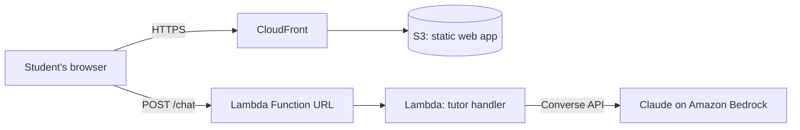

# MathMentor Barbados 🇧🇧 — Socratic AI Math Tutor

A Bajan AI math tutor that refuses to just give you the answer. MathMentor uses Claude on Amazon Bedrock with a Socratic system prompt: it asks what you've tried, points at where your work went wrong, and guides you to the solution one hint at a time. Math renders properly with KaTeX.

Built for Barbadian students: the tutor knows the local journey from Common Entrance (BSSEE) through CSEC/CXC Mathematics to CAPE, encourages in a warm Bajan voice while keeping every mathematical step in clear standard English, and uses everyday Barbadian contexts (BBD prices, bus fares, cricket) in its examples.

**Stack:** Claude (Amazon Bedrock Converse API) · AWS Lambda (Function URL) · S3 + CloudFront (OAC) · OpenTofu

## Architecture



The frontend is a single dependency-free HTML page (KaTeX from CDN). The backend is one Node.js Lambda that validates the conversation, applies the Socratic tutoring prompt, and calls the Bedrock Converse API. No data is stored; the conversation lives only in the browser tab.

## Why Socratic?

Tutoring tools that hand out answers optimize for homework completion, not learning. The system prompt enforces pedagogy: never reveal the final answer, one hint per turn, locate the student's error and ask a question about it, confirm and recap only once the student gets there themselves. Prompt design is the core of this project; see `backend/handler.mjs`.

## Why Bajan?

Most AI tutors default to US curricula and contexts. MathMentor is syllabus-aware for the Caribbean (CXC methods for CSEC students, not whatever a generic model assumes) and meets students in a familiar voice. The persona rules are deliberate: dialect for warmth and encouragement only, standard English for every mathematical statement, and no caricature.

## Deploy

Prerequisites: an AWS account with Bedrock model access enabled for Claude (check the model ID in `infra/variables.tf`), plus OpenTofu or Terraform.

```bash
cd infra
tofu init
tofu apply
```

Outputs include `site_url` (the CloudFront URL) and `api_url`. The deploy injects the API URL into the web page automatically. After the first apply, tighten `allowed_origins` to your CloudFront domain and re-apply.

Cost: serverless throughout; a few cents per study session with Claude Haiku.

## Roadmap

- Response streaming (Lambda response streaming + InvokeWithResponseStream)
- Image input for photographed homework problems
- Per-topic practice problem generator
- Optional session history with DynamoDB + TTL

## License

MIT — built by [Christopher Corbin](https://christophercorbin.cloud)
